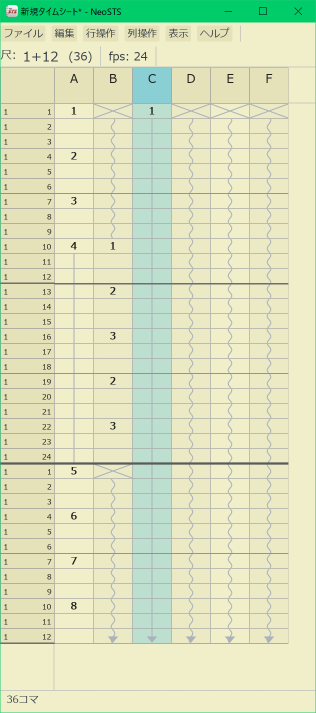

# NeoSTS
<p align="center">
  
</p>

NeoSTS は、STS 系のアニメ撮影タイムシートを軽快に編集するためのデスクトップアプリです。

基本の編集挙動は STS をベースにしつつ、After Effects 系のキーフレーム編集で便利な考え方を一部取り入れています。既存の `.sts` 資産を扱いながら、いまの制作環境で使いやすいシートエディタを目指しています。

## 特徴

- 軽快な起動と表編集を重視したデスクトップアプリ
- `.sts` の読み込みと保存
- `.sxf` `.ard` `.xdts` `.tdts` `.ditis` の読み込み
- After Effects との連携
- 列編集、行編集、アンドゥ/リドゥ、キーバインド変更、配色変更などの編集機能
- ミニマップ、最近開いたファイル、常に手前に表示、表示倍率の拡大縮小とリセット などの作業補助

## 編集方針

通常の Enter、Cut、Paste、増減入力などは STS ベースの挙動です。セル単位で値を埋めていく、従来の STS に近い操作感を重視しています。

一方で、ドラッグ移動やドラッグコピーのような NeoSTS 独自の直接操作では、AEIOU 系のキーフレーム的な考え方を取り入れています。これにより、基本は STS のまま、連続区間を扱う操作だけを軽快にしています。

## 対応ファイル形式

| 形式    | 読み込み | 保存 |
| ------- | -------- | ---- |
| `.sts`  | Yes      | Yes  |
| `.sxf`  | Yes      | No   |
| `.ard`  | Yes      | No   |
| `.xdts` | Yes      | No   |
| `.tdts` | Yes      | No   |
| `.ditis` | Yes     | No   |

`.sts` 以外は読み込み専用です。

### 読み込み時の注意

- `.xdts` `.tdts` `.ditis` は UTF-8 テキストとして読み込みます。BOM 付き UTF-8 も受け付けます。
- `.tdts` は 1 ファイルに複数の `timeSheets` を持てますが、現状は先頭のシートだけを開きます。
- `.ditis` も複数シートを持てる構造ですが、現状は先頭のシートだけを開きます。

## 主な機能

- 新規シート作成、シート設定変更、最近開いたファイル
- カット、コピー、ペースト
- アンドゥ / リドゥ
- 行の中抜き、継ぎ足し行の追加と削除
- 列名変更、左右への列挿入、列削除
- 選択範囲の移動、ジャンプ、拡張、縮小
- 表示倍率の拡大、縮小、リセット
- ミニマップ表示
- 表示テーマ、色、サイズ、ヘッダ表示頻度のカスタマイズ
- キーバインド変更
- 選択列データの After Effects 送信
- After Effects の選択レイヤーから新規シート作成

## 基本操作

- セルをクリックすると選択できます。クリックドラッグで複数セルを範囲選択できます。
- 行ヘッダをクリックすると行選択、列ヘッダをクリックすると列選択になります。
- 矢印キーで選択範囲を上下左右に移動できます。
- `j` / `k` で選択範囲を上下にジャンプできます。
- `Shift+↑` / `Shift+↓` または `/` / `*` で選択範囲を縮小・拡張できます。
- 数字キーで選択セルに入力できます。入力中の数字はバッファされ、`Enter` で確定します。
- `+` / `-` は、入力バッファが空なら直前値を基準に増減入力、数字入力の途中ならその時点の値を確定します。
- `Delete` で選択範囲の値を削除できます。macOS では通常の `delete` キーでも削除できます。入力中は `Delete` / `Backspace` で数字を1文字消せます。`Esc` で入力中の数字をキャンセルできます。
- 値を確定したあとは、選択範囲が1行下へ進みます。
- 選択範囲の中を `Ctrl+ドラッグ` で移動、`Ctrl+Shift+ドラッグ` でコピーできます。macOS では `Ctrl` の代わりに `Cmd` を使います。
- `Ctrl+=` / `Ctrl+-` / `Ctrl+0` で表示倍率の拡大、縮小、リセットができます。macOS では `Ctrl` の代わりに `Cmd` を使います。
- `Ctrl+M` でミニマップ表示を切り替えられます。macOS では `Cmd+M` です。
- 行ヘッダや列ヘッダを右クリックすると、その行・列に対する操作メニューを開けます。

## After Effects 連携について

After Effects 連携は、ローカルで起動中の After Effects に対してスクリプトを送る方式で動作します。

Windows では `AfterFX.exe -r` 経由で一時 JSX を実行しているため、After Effects 側の「最近使ったスクリプト」や MRU が一時ファイルで汚れることがあります。現状は仕様として扱っており、将来的には専用プラグインなどで改善したいと考えています。

現状は単一起動の After Effects を前提にしています。`AfterFX.exe -m` などで After Effects を複数起動している場合は、送信先や取得元のインスタンスを正しく特定できないことがあります。そのため、現時点では単一インスタンスでの利用を推奨します。

複数立ち上げてレンダリングを片方で回したい場合は、-mをつけたAEでレンダリングをしたり、監視として立ち上げるなどして、作業するAEは-mをつけずに起動するとNeoSTSは-mの無い方を見つけることができますので、そのような運用にすると良いと思います。

複数インスタンス環境での安定した連携は今後の課題で、将来的には NeoSTS 専用プラグインによる改善を検討しています。

## 動作環境

- Rust toolchain
- デスクトップ環境
- After Effects 連携は OS とインストール環境に依存します

開発上は Windows と macOS を前提にしています。

## ビルドと起動

```bash
cargo run
```

ファイルを指定して開く場合:

```bash
cargo run -- path/to/file.sts
```

## 配布用ビルド

通常のリリースビルド:

```bash
cargo build --release
```

macOS の `.app` バンドルは、macOS 上で次のスクリプトから作成できます。

```bash
./scripts/bundle-macos-app.sh
```

GitHub Releases などから取得した macOS 版アプリは、未署名のため初回起動時に macOS から「破損している」ような警告が出ることがあります。その場合は quarantine 属性を外してから起動してください。

```bash
xattr -dr com.apple.quarantine /path/to/NeoSTS.app
```

## ライセンス

MIT

サードパーティライセンスは [THIRD_PARTY_LICENSES.txt](THIRD_PARTY_LICENSES.txt) を参照してください。

更新する場合:

```powershell
powershell -ExecutionPolicy Bypass -File scripts\generate-third-party-licenses.ps1
```
